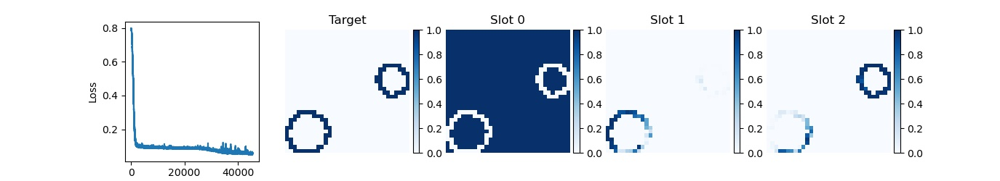

# README

**Goal:** Slot atttention for clustering studies. There are a lot of notebooks while brainstorming what the issues might be, but some of the experiments are (in ~ reverse chronological order):

### Multi-Rings

- `Softmax-Temperature`: Looking at some experiments across varying the architecture size and softax temperature. This notebook just has loss curves rn, the other plots get saved in the corresponding `code/figures/{config-id}` folder
- `Hungarian-multi-rings`: This notebook is ~ identical to the `Hungarian-multi-rings.ipynb`, but the models don't train long enough in the notebook to get nice figures. But... training for longer with the slurm batch system seems like some of these models are starting to converge, e.g, (although still needs more training time... which is in progress).

### Multi-Blobs Hungarian Loss

- `Hungarian-multi-rings`: This notebook is the "bug fix" for the Hungarian loss implementation, and looks like it is working for the blobs :)
    * Not fully optimized yet... but definitely doing something
    * Also some experiments for looking at batch size and learning rate schedules

### Diagnosing a single ring example

I wanted to get a feeling where the loss was coming from

- `SA-mini`
- `Hungarian-1-ring-sanity-check`
- `Encoder-opt-pos-embed`
- `Encoder-optimization-rings`

### Lukas's Autoencoder notebook(s)

- `WTFAE.ipynb`: OG nb from Lukas (no edits)
    ^ This model was used for all of the above notebooks too (all of the pytorch models)
- `WTFAE.ipynb2`: Rerunning Lukas's nb 
- `WTFAE-Flos-data`: Rerunning Lukas's nb w/ Flo's dataset
    * Ran out of the box for blobs
    * The default hps / training times didn't work for rings

### Working in tensorflow in the official repo (with Sara)

- `Toy-prob.ipynb`: a toy 2 photon case working with slot attention with the official google TensorFlow repo.

This notebook also needs the `slot_attention/model.py` to with a class `SlotAttentionSara` to have the 9x9 grid dimesnionalty in my clone of the offical google repo:
`git clone https://github.com/nhartman94/google-research.git`

## Code

The useful functions that are used across notebooks are in the `code repo`, and I started submitting trainings to grid jobs too.

Also, the output of models and figures plotting performance through the training time are getting saved here as well.

README updated 18 Aug 2023
